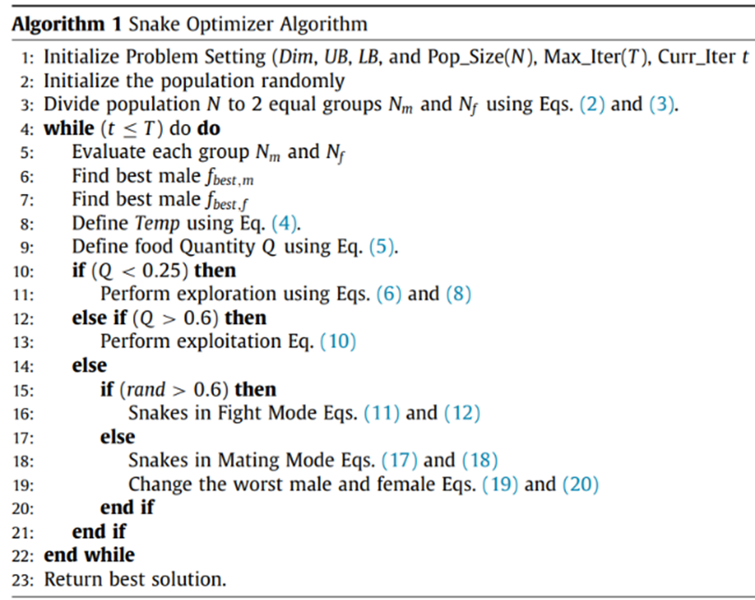

# Algorithm

$$
\begin{aligned}
& Temp = \exp\left(\frac{-t}{T}\right) && (4) \\
& Q = c_1 \times \exp\left(\frac{t - T}{T}\right) && (5) \\
& X_{i,m}(t+1) = X_{rand,m}(t) \pm c_2 \times A_m \times \left((X_{max} - X_{min}) \times rand + X_{min}\right) && (6) \\
& A_m = \exp\left(\frac{-f_{rand,m}}{f_{i,m}}\right) && (7) \\
& F_{nt} = minimize \frac{1}{N} \sum{_{i=1}^{N}} \left( I \left( y_i^{(test)} = y_i^{pred} \right) \right) && (9) \\
& X_{i,j}(t+1) = X_{food} \pm c_3 \times Temp \times rand \times (X_{food} - X_{i,j}(t)) && (10) \\
& X_{i,m}(t+1) = X_{i,m}(t) + c_3 \times FM \times rand \times (Q \times X_{best,f} - X_{i,m}(t)) && (11) \\
& FM = \exp\left(\frac{-f_{best,f}}{f_i}\right) && (13) \\
& X_{i,m}(t+1) = X_{i,m}(t) + c_3 \times M_m \times rand \times (Q \times X_{i,f}(t) - X_{i,m}(t)) && (15) \\
& M_m = \exp\left(\frac{-f_{i,f}}{f_{i,m}}\right) && (17) \\
& X_{worst,m} = X_{min} + rand \times (X_{max} - X_{min}) && (19)
\end{aligned}
$$

# Reference
Hashim, F. A., & Hussien, A. G. (2022). Snake optimizer: A novel
meta-heuristic optimization algorithm. Knowledge-Based Systems, 242, 108320. https://doi.org/10.1016/j.knosys.2022.108320
