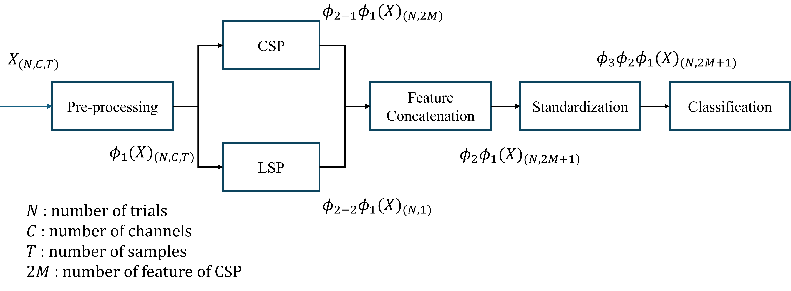

# Confuse Matrix

<table style="margin: 0 auto; text-align: center;">
  <tr><td></td><td>Predict Positive</td><td>Predict Negative</td></tr>
  <tr><td>Actually Positive</td><td>TP</td><td>FN</td></tr>
  <tr><td>Actually Negative</td><td>FP</td><td>TN</td></tr>
</table>

# Metrix
$$
\begin{aligned}
\text{acc} = \frac{\text{TP}+\text{TN}}{N}
\end{aligned}
$$

$$
\begin{aligned}
\text{precision} = \frac{\text{TP}}{\text{TP}+\text{FP}}
\end{aligned}
$$

$$
\begin{aligned}
\text{recall} = \frac{\text{TP}}{\text{TP}+\text{FN}}
\end{aligned}
$$

$$
\begin{aligned}
\text{specificity} = \frac{\text{TN}}{\text{FP}+\text{TN}}
\end{aligned}
$$

$$
\begin{aligned}
\text{f1} = \frac{2 \cdot \text{precision} \cdot \text{recall}}{\text{precision} + \text{recall}}
\end{aligned}
$$

$$
\begin{aligned}
\text{pe} = \frac{\text{TP}+\text{FN}}{N}\frac{\text{TP}+\text{FP}}{N}+\frac{\text{TN}+\text{FP}}{N} \frac{\text{FN}+\text{TN}}{N}
\end{aligned}
$$

$$
\begin{aligned}
\text{kappa} = \frac{\text{acc}-\text{pe}}{1-\text{pe}}
\end{aligned}
$$

# Flow Chart

